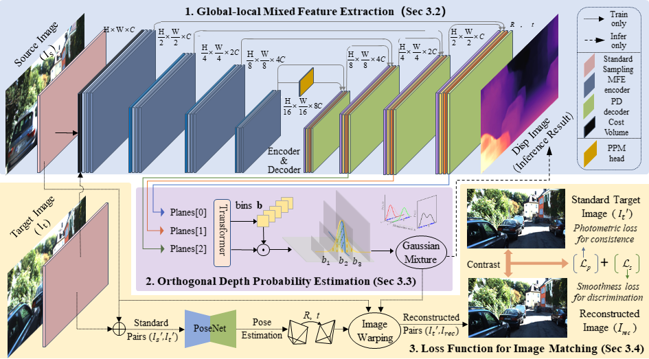
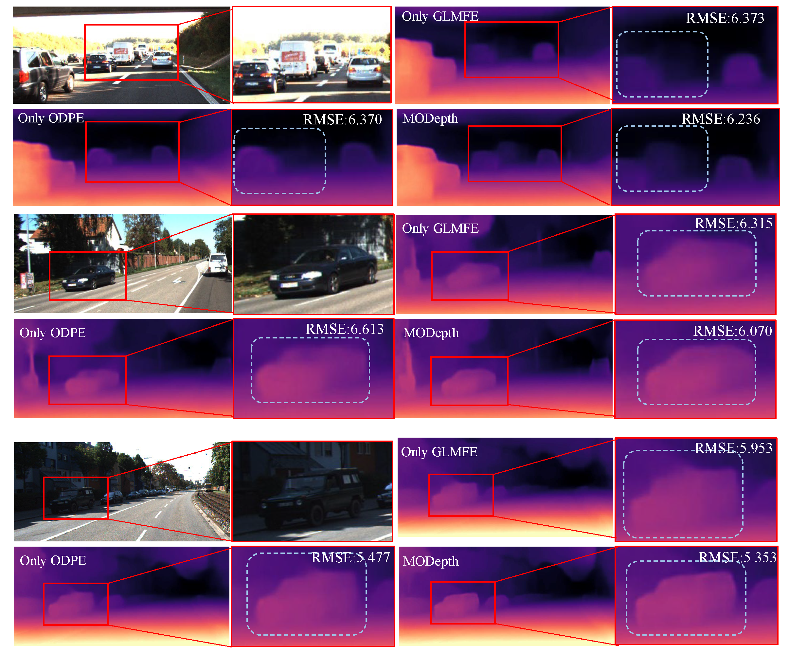

 <h3 align="center">MODepth: Mixed Features and Orthogonal Representations for Self-supervised Monocular Depth Estimation</h3>

</p>

  <a href="" target='_blank'>
    
  </a>

<!-- TABLE OF CONTENTS -->

<details>
  <summary>Table of Contents</summary>
  <ol>
    <li>
      <a href="#about">About</a>
    </li>
    <li>
      <a href="#Pipline of MODepth">Pipline of MODepth</a>
    </li>
    <li><a href="#Spatial projection observation with MeshLab">Spatial projection observation with MeshLab</a></li>
    <li><a href="#Depth error and spatial projection maps">Depth error and spatial projection maps</a></li>
    <li><a href="#Ablation study">Ablation study</a></li>
    <li><a href="#Upcoming releases">Upcoming releases</a></li>  
    <li><a href="#Inference">Inference</a></li>  
    <li><a href="# Pretrained weights and evaluation"> Pretrained weights and evaluation</a></li>  
    <li><a href="#Acknowledgement">Acknowledgments</a></li>
    <li><a href="#license">License</a></li>
  </ol>
</details>

<!-- TABLE OF About-->


# Pipeline of MODepth

MODepth employs an encoder-decoder model to extract the features only from the source image, an orthogonal estimation model to infer the depth probability from the features, and an image matching method to train the whole model considering the warping loss based on the source image, target image and depth probability.



#  Spatial projection observation with MeshLab

To visually inspect whether the generated depth map effectively planarized pixels on the same plane, we project the depth and its color image into three-dimensional space and utilize MeshLab for observation.


# Depth error and spatial projection maps

We have individually compared the depth maps and their error metrics produced by MonoDepthv2, ManyDepth, and MODepth on the KITTI dataset. We projected these onto 3D space to observe the positioning of the targets and whether the foreground targets are coplanar with the background. MODepth demonstrates effectiveness in separating the depth of foreground and background objects.


# Ablation study

In our ablation study, we meticulously dissected the contributions of various components within MODepth to understand their impacts on performance. 



This systematic evaluation allowed us to identify the key factors that significantly enhance the accuracy and robustness of our depth estimation methodology.

# Upcoming releases

- [x] release code for evaluating in KITTI

- [ ] model release KITTI, Cityscapes

## Inference

```bash
python test_simple.py 
```


## 💾 Pretrained weights and evaluation

You can download weights for some pretrained models here:

* [KITTI MR (640x192)](https://drive.google.com/file/d/1IfveSOMBLO1lv7hsaCe_fxMTXG4wsxsL/view?usp=sharing)
* [KITTI HR (1024x320)]()
* [CityScapes (512x192)]()

To evaluate a model on KITTI, run:

```bash
CUDA_VISIBLE_DEVICES=<your_desired_GPU> \
python -m manydepth.evaluate_depth \
    --data_path <your_KITTI_path> \
    --load_weights_folder <your_model_path>
    --eval_mono
```

Make sure you have first run `export_gt_depth.py` to extract ground truth files.

## Acknowledgement

Special thanks to the following awesome projects!

- [ManyDepth](https://github.com/nianticlabs/manydepth)
- [PlaneDepth](https://github.com/svip-lab/PlaneDepth)
- [Binsformer](https://github.com/zhyever/Monocular-Depth-Estimation-Toolbox)

##  License


All rights reserved. Please see the [license file](LICENSE) for terms.
