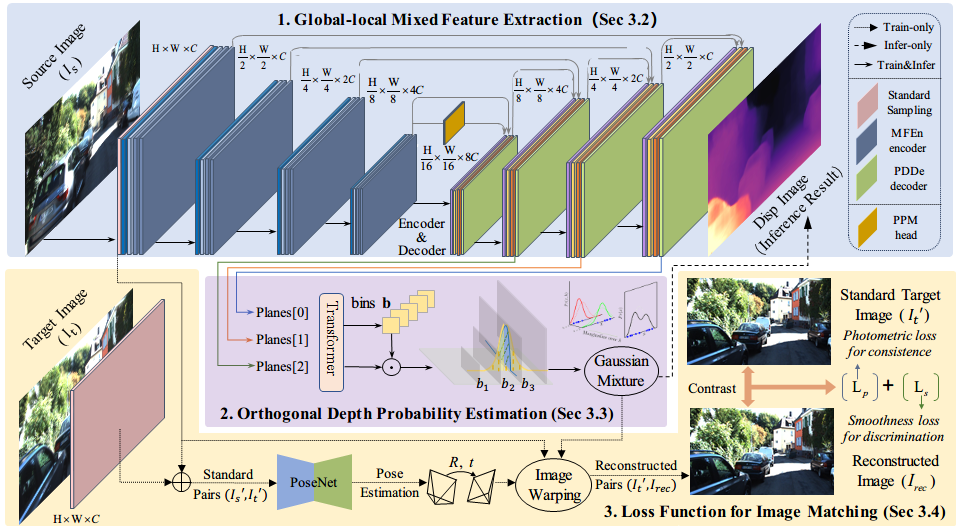

# MODepth: Mixed Features and Orthogonal Representations for Self-supervised Monocular Depth Estimation


# Pipeline of MODepth




# Observation with MeshLab

To visually inspect whether the generated depth map effectively planarized pixels on the same plane, we project the depth and its color image into three-dimensional space and utilize MeshLab for observation.


# Depth error and spatial projection maps

We have individually compared the depth maps and their error metrics produced by MonoDepthv2, ManyDepth, and MODepth on the KITTI dataset. We projected these onto 3D space to observe the positioning of the targets and whether the foreground targets are coplanar with the background. MODepth demonstrates effectiveness in separating the depth of foreground and background objects.


# Ablation study


# Upcoming releases

- [x] release code for evaluating in KITTI

- [ ] model release KITTI, Cityscapes

## Inference

```bash
python test_simple.py 
```


## 💾 Pretrained weights and evaluation

You can download weights for some pretrained models here:

* [KITTI MR (640x192)](https://drive.google.com/file/d/1IfveSOMBLO1lv7hsaCe_fxMTXG4wsxsL/view?usp=sharing)
* [KITTI HR (1024x320)]()
* [CityScapes (512x192)]()

To evaluate a model on KITTI, run:

```bash
CUDA_VISIBLE_DEVICES=<your_desired_GPU> \
python -m manydepth.evaluate_depth \
    --data_path <your_KITTI_path> \
    --load_weights_folder <your_model_path>
    --eval_mono
```

Make sure you have first run `export_gt_depth.py` to extract ground truth files.

## Acknowledgement

Special thanks to the following awesome projects!

- [ManyDepth](https://github.com/nianticlabs/manydepth)
- [PlaneDepth](https://github.com/svip-lab/PlaneDepth)
- [Binsformer](https://github.com/zhyever/Monocular-Depth-Estimation-Toolbox)

##  License


All rights reserved. Please see the [license file](LICENSE) for terms.
